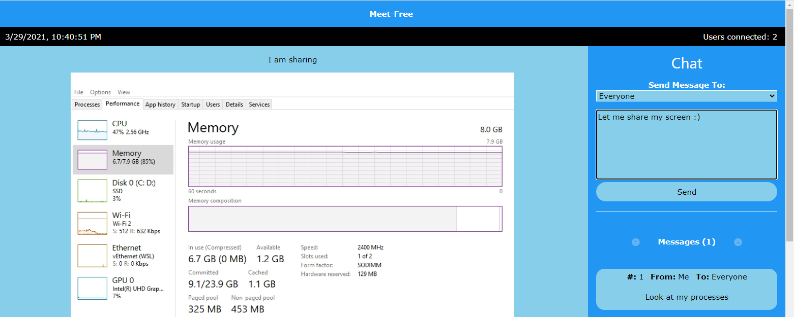

# meeting_app

A simple video conferencing app using [node.js](https://nodejs.org/en/), [express](https://expressjs.com/), [socket.io](https://socket.io/), [peerjs](https://peerjs.com/), [vue.js](https://vuejs.org/), and [vuex](https://vuex.vuejs.org/).

Inspired by the YouTube tutorial [How To Create A Video Chat App With WebRTC](https://www.youtube.com/watch?v=DvlyzDZDEq4&t=1466s) by [Web Dev Simplified](https://www.youtube.com/channel/UCFbNIlppjAuEX4znoulh0Cw).




## Setup

## Install Peer JS Server

Follow the instructions here: https://github.com/peers/peerjs-server#run-server .

### Create .env file

In the root directory of the project, create a `.env` file.

Enter the following values in the file:

```
PEERJS_HOST = /
PEERJS_PORT = 3001
```

These values are used to run server.js when you want computers on your home network to connect to your computer for video conferencing.

Later, if you want to connect to your server.js with a public internet address using [ngrok](https://ngrok.com/) , see [Using ngrok](#using-ngrok). But for now, let's just get you set up for running for use on your home network.

### Create cert.pem and key.pem files

Both the peerjs server and server.js will be running in https mode and will require cert.pem and key.pem files to be present in the meeting_app/certs directory.

Follow the instructions in [Creating SSL Certificate and Key](./certs/readme.md) to create these two files.

### Get Dependencies

In the meeting_app directory, type:

```sh
npm install
```

### Start the peerjs server

In a windows command window, in the meeting_app directory:

```sh
npm run start-peerjs-ssl
```

`start-peerjs-ssl` is defined in the scripts section of the package.json

### Start server.js

To start the main file, server.js :

```sh
npm start
```

### Open the web app in the browser

In your browser, navigate to `https://localhost:443/videochat` .

- You will need to accept the certificate warning. On Chrome, there should be an Advanced twistie that you can open and then select `Proceed`.
- You will need to click on the Allow button so that browser can use the webcam and microphone.

Find out your machine IP address on your internal network, and then, from another computer, connect to https://yourServerIPAddress:443/videochat (Or from a private Incognito window on the same computer. Careful, you will get microphone feedback ;)

## Using ngrok

To connect to your server.js and peerjs server from a public internet address, you can use [ngrok](https://ngrok.com/) to create a tunnel from an ngrok domain (you created in your ngrok account) to the port running your server.js and the port running your peerjs server on your computer.

### Start the ngrok processes

Since your are running two servers on your machine, you need to start two ngrok processes; each in their own command window

Start an ngrok tunnel for the peerjs server port:

```sh
ngrok http -hostname=subdomain2.yourhost.com https://localhost:3001
```

Start an ngrok tunnel for the server.js port:

```sh
ngrok http -hostname=subdomain1.yourhost.com https://localhost:443
```

Where subdomain1 and subdomain2 are defined in your ngrok account, and you uploaded your certificate to ngrok, and chose this uploaded certificate for each domain configuration.

I had an actual website already, e.g. www.myhost.com . I went in to the DNS Zone of the control panel of my website, and created two CNAME records.

- subdomain1 with a value of a generated ngrok domain url provided for this domain.
- subdomain2 with a value of a generated ngrok domain url provided for this domain.

### Modifying your .env file

```
PEERJS_HOST = subdomain2.yourhost.com
```

where subdomain is the CNAME you defined in the DNS section of your website domain (yourhost.com).

There is no need to specify PEERJS_PORT; otherwise the front end, defined in room.ejs, will not be able to connect to peerjs. Not sure why.

### Open EACH url in your browser; Second one first

- You need to hostname=subdomain2.yourhost.com in your browser and accept your certificate and proceed via the Advanced tab
- You need to hostname=subdomain.yourhost.com in your browser and accept your certificate and proceed via the Advanced tab
